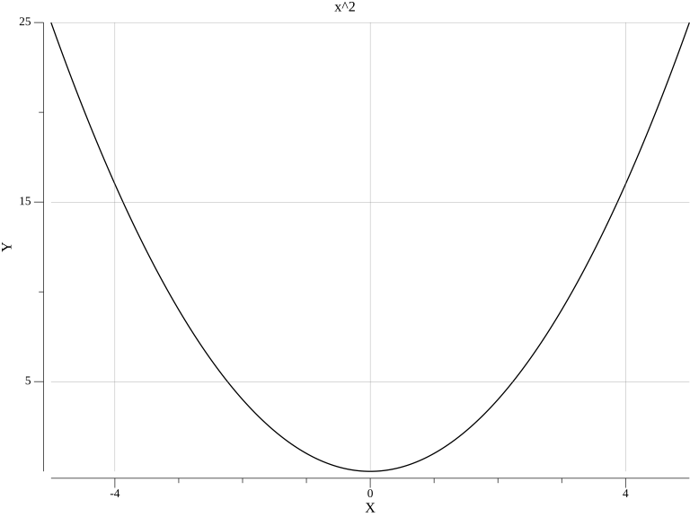
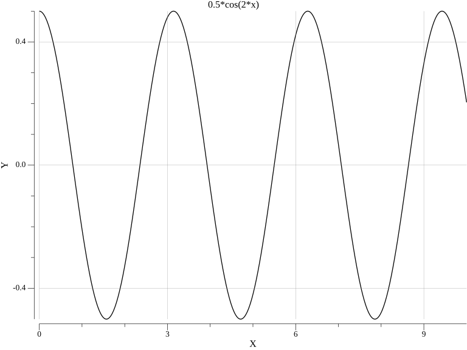

# Mint Graphics Calc - an easy CLI utility to create graphics

graphics examples :
- 
- 

How to use the utility :

```bash
Mgc -f "%formula%" -min %x% -max %x% -step %x% -out %file name%
```

example :
```bash
Mgc -f "x^2" -min -5 -max 5 -step 0.01 -out parabola.png           
```

Supported:
- Functions:
    - cos
    - sin
    - tan
    - log
    - sqrt
- Operations:
    - plus
    - minus
    - mul
    - div
    - pos

MGC uses recursion to build expressions.